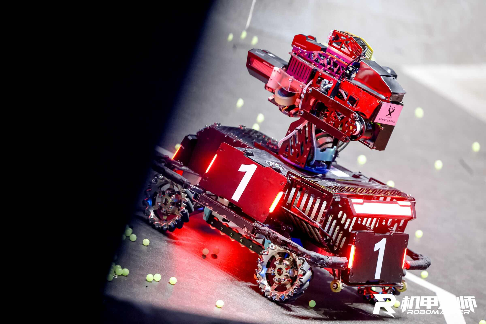

<div align="center" float="left">
<a href="https://www.robomaster.com/zh-CN">

</a>
&nbsp;&nbsp;&nbsp;&nbsp;&nbsp;&nbsp;&nbsp;&nbsp;&nbsp;

</div>
<br>
<div align="center">
<b> 华中科技大学 狼牙战队 视觉组 </b>
 </div>

## 效果展示 🎥
<div align="center">
<h4>
全国赛效果
</h4>


<h4>
分区赛效果
</h4>


国赛全程视频：
[【沉浸式辅瞄前哨站 | B 站】](https://www.bilibili.com/video/BV1ubYueDEk9/)
</div>

## 功能简介 🔎

本赛季英雄机器人算法开发的功能主要包括前哨站击打、车辆击打辅瞄、绿灯辅助吊射三项。

前哨站击打与车辆击打辅瞄采用了较为广泛使用的延迟击打方案。

绿灯辅助吊射结合先验的距离，通过识别基地顶部的飞镖引导灯辅助吊射。

## 环境配置 🛠

### 硬件环境 📡

| 硬件           | 型号        |
| -------------- | ----------- |
| 车载算力平台   | NUC11       |
| 大恒相机传感器 | \           |
| 镜头           | 8mm 焦段     |
| 下位机通信     | C 板虚拟串口 |

### 软件环境 🖥
```
GCC
OpenVINO >= 2023.0
OpenCV
Eigen
Sophus
Glog 
CeresSolver
Jsoncpp
GalaxyCamera
```

*由于 yolov8和 yolov10使用了大于 opset11的 op，需要使用 OpenVINO 2023.0以上版本进行编译。具体请参照 OpenVINO[官方文档](https://docs.openvino.ai/2023.3/openvino_docs_ops_opset.html)。*

### 编译运行 🚀

```shell
mkdir build
cd build
cmake ..
make -j8
./AutoAim
```

## 框架功能 📦

1. 使用 OpenVINO 进行深度学习模型的部署
2. 使用 glog 进行日志记录
3. 借助 UDP 协议以及 VOFA+ 工具，进行数据的可视化查看与调试（使用方式见下方开源仓库）
[https://github.com/liulog/Debug_udp_VOFA](https://github.com/liulog/Debug_udp_VOFA)
4. 使用 jsoncpp 进行配置文件的读取，所有因车而异的参数均可通过配置文件进行调整，所有需要调整的参数见 [src/utils/tools/init.json](src/utils/tools/init.json)

## 重要原理阐述 ♾️

### 静止靶辅瞄 🎯

#### 目标位姿估计 🎯

对于英雄的辅瞄来说，目标的位姿估计尤为重要。首先我们需要知道目标装甲板中心距离。其次需要知道装甲板的朝向，如果目标装甲板的朝向过于倾斜，就有被识别为小弹丸的风险，故需要对大弹丸的击打区间进行判定。

受限于本赛季装甲板的识别方案，我们装甲板灯条存在一定的取点误差，在 8mm 镜头下， PnP 的距离解算误差可达 20%。由于大弹丸的弹速较低，大弹丸的弹道对距离异常敏感， 20% 的距离误差会造成云台的上下抖动。通过引入均值滤波，我们消除了部分抖动，但是对于更远距离的物体存在严重的误差造成弹道偏移。

#### 弹道方程 ♾️

假设炮弹在空气中飞行，考虑空气阻力和重力作用，我们得到的微分方程可以表示为：

$$
m \frac{\mathrm dv_y}{\mathrm dt} = -mg - k_1 v v_y
$$

其中 $v_y$ 是垂直方向的速度分量， $v$ 是速度的大小， $m$ 是质量， $g$ 是重力加速度， $k_1$ 是与空气阻力相关的系数。

飞行时间由以下公式给出：

$$
T = \frac{e ^ {k_1 \cdot d} - 1}{k_1 \cdot v \cdot \cos(\theta)}
$$

其中：
- $k_1$ 是空气阻力系数相关的常数；

- $d$ 是目标的水平距离；

- $v$ 是炮弹初速度；

- $\theta$ 是俯仰角度。

炮弹的垂直位移由以下公式给出：

$$
\delta_z = z - \frac{v \cdot \sin(\theta) \cdot T}{\cos(\theta)} + \frac{0.5 \cdot g \cdot T ^ 2}{\cos ^ 2(\theta)}
$$

其中：

- $z$ 是目标的高度；

- $g$ 是重力加速度；

- 其他符号如上定义。

最终我们使用牛顿迭代法来求解俯仰角度 $\theta$ ，以满足垂直方向的运动方程，具体为：

$$
\theta_{n+1} = \theta_n - \frac{\delta_z}{f'(\theta)}
$$

其中 $f'(\theta)$ 是垂直方向位移方程对 $\theta$ 的导数。

当目标在世界坐标系下的坐标足够精确时，我们可以用这个方程很好地拟合 42mm 弹丸的飞行轨迹。上述弹道方程中，唯一常数为空气阻力系数，经实验该系数直接使用球体的体积常数就有良好的效果。经过进一步的微调我们将该常数略降低了一些，这与大弹丸表面的凹坑有关。实践上，在 15-16 米每秒的弹速条件下，该方程的主要误差来源于装甲板距离解算的误差。

上述弹道解算代码可见 [src/pose_estimate/src/PoseSolver.cpp](src/pose_estimate/src/PoseSolver.cpp) 中的 `solveGimbalPose` 函数。

#### 弹道标定 🚀

通过上述控制变量的研究和实验，我们对姿态估计和弹道方程的误差都有了定量的认知。在对英雄弹道标定时，只需要调整相机与云台发射机构的相对误差即可。我们引入了 yaw、 pitch、 roll 三个纬度的相机旋转和一个平移向量描述发射机构和相机之间的误差。

$$
\boldsymbol P_g=\boldsymbol P_c\boldsymbol R_z(\phi)\boldsymbol R_y(\theta)\boldsymbol R_x(\psi)+\boldsymbol t
$$

其中：

- $\boldsymbol P_g$ 是装甲板目标在世界坐标系下的坐标

- $\boldsymbol P_c$ 是装甲板目标在相机坐标系下的坐标

- $\boldsymbol R_z$、 $\boldsymbol R_y$ 、 $\boldsymbol R_x$ 是对应 yaw、 pitch、 roll 的旋转矩阵

- $\boldsymbol t$ 是在世界坐标系下从云台发射机构中心到相机光心的平移向量

该方案实现了对车辆发射过程整体的完整建模，同时保留了可视化调参的方式，只需要调整 $\boldsymbol t$ 和 $\phi, \theta, \psi$ ，可以快速调整。经过实测，在相机正常装配情况下，平移向量仅高度方向敏感，相机的旋转角度可通过将世界坐标系的坐标轴可视化进行标定（见 [src/pose_estimate/src/PoseSolver.cpp](src/pose_estimate/src/PoseSolver.cpp) 中的 solveArmor 函数中的注释部分）。熟练后，仅需 10 分钟可以完成一辆英雄机器人的弹道标定。

该标定算法可见 [src/pose_estimate/src/PoseSolver.cpp](src/pose_estimate/src/PoseSolver.cpp) 中的 `Posesolver()` 构造函数。

但是该方案也有缺陷，最严重的问题是无法应对倾斜状态下三摩擦轮弹道的自旋。在实践中我们发现，当处于斜坡击打时，由于三摩擦轮对弹丸的受力不均匀，发射出的子弹会产生较大的自旋，该自旋会导致弹道向某方向漂移。且随着倾斜角度的增大，漂移越大。该现象严重影响我们在公路区和小资源岛中间的斜坡处的击打命中率。我们发现该问题后，临时引入了一个与云台 roll 角有关的参数对弹道进行末端修正，解决了这个问题。但该基于末端的修正背离了整体建模的初衷，该修正方法对于近处物体可能造成过修正的问题。

### 绿灯辅助吊射 🟢

无论是 8 米吊射还是 25 米吊射，在单一平视角度的相机下都几乎无法完整识别装甲板。即便成功识别装甲板，仍会有非常大的解算误差。因此我们设计了一个识别基地顶部绿灯进行辅助吊射的方案。但是绿灯的识别为单点识别，仅依赖于绿灯的识别无法进行姿态解算。我们引入吊射点位距离和高度作为先验知识，结合绿灯的单点识别可以进行姿态估计。

### 前哨站辅瞄 🎯

本赛季前哨站辅瞄最大的改动在于摒弃了使用先验的转速作为延迟击打参数。经过分析，英雄机器人在前哨站击打时击打区间仅有 80 毫秒左右，超过该区间会造成命中偏差或者被识别为小弹丸。由于我们无法保证自制的前哨站转速与官方前哨站转速完全一致，所以如果使用先验的转速参数，很有可能造成“过拟合”的现象，即使用家中的前哨站可以命中而上场时会被识别为小弹丸或者无法命中。经过实际的测试家中的前哨站与官方给定的参数可能存在 5% 左右的误差，通过调取场上观测日志，我们发现官方前哨站转速本身也会存在 5% 左右的误差，极端情况下，两者叠加可能造成 10% 以上的误差，该误差足以使辅瞄无法命中。因此我们设计算法对前哨站转速去耦合。我们还惊喜地发现，该方案亦可适用于对静止小陀螺的普通步兵进行辅瞄延迟击打，在联盟赛中针对原地旋转的哨兵机器人收获了良好的效果。

前哨站辅瞄还依赖于英雄机器人链路发弹延迟的参数。我们设计了一个测试发弹延迟测定的流程，并实现了发弹延迟 5ms 级别的测定。符合直觉地，弹链的顺滑程度与发弹延迟完全相关。我们通过优化弹链结构，实现了发弹延迟的最小化和稳定。
<table>

  <tr>
    <td> 发弹延迟均值 </td>
    <td>165ms</td>
  </tr>
  <tr>
    <td> 发弹延迟标准差 </td>
    <td>0.0127</td>
  </tr>
</table>

本赛季英雄机器人前哨站辅瞄算法流程如下。（见 [src/pose_estimate/src/PoseSolver.cpp](src/pose_estimate/src/PoseSolver.cpp) 中 `antitop` 函数）

1. 拟合前哨站的击打中心。我们设计了一个队列存储每一帧捕获的前哨站装甲板的姿态信息，当队列内装甲板的数量超过一定阈值后，删除距离最远或倾斜角度最大的装甲板。当完整经过第一片扇叶后，前哨站的击打中心即可使用该队列内的所有装甲板的几何平均值得出。
2. 捕获前哨站扇叶经过击打区域的上升沿信号。我们将所有经过击打中心一定距离内的装甲板定义为处于击打区域。每当有扇叶经过该区域时，通过计算该信号的上升沿的时间差即可实现对装甲板旋转速度的估计。
3. 设置延迟击打。当有扇叶经过击打区域时，通过计算弹丸飞行时间结合发弹延迟、前哨站的旋转速度可以得到我们需要延迟击打的时间。

上述算法思路非常简单，但需要注意几个问题。

1. 中心的估计：在我们的深度学习的识别模型中，特定角度下的装甲板会出现取点异常外扩，导致在该角度下 PnP 解算的距离会变近，在上述采用删除距离最远的装甲板的思路中会存在中心点偏移的问题。解决方案是结合倾斜角度进行辅助删除判断。（见 [src/pose_estimate/src/PoseSolver.cpp](src/pose_estimate/src/PoseSolver.cpp) 中 `antitop` 函数）
2. 中心区域的设置：由于 PnP 解算距离误差较大，击打中心实际上可能会出现较大的前后距离误差，如果我们粗暴地设计一个距离范围可能会导致装甲板实际经过击打区域而无触发的情况。数学上可以分析，该问题其实是因为将问题的纬度引入三维导致。我们最终设计了一个基于图像上二维坐标的“距离函数”。这个距离函数对水平方向的变化极为敏感，对竖直方向不敏感。实现了对装甲板经过击打区域的百分百触发。（见 [src/pose_estimate/src/PoseSolver.cpp](src/pose_estimate/src/PoseSolver.cpp) 中 `antitop` 函数）
3. 触发信号的消抖：由于装甲板识别帧率较高，识别过程中可能会在触发边缘反复触发的情况。我们采用和硬件消抖一个原理，设计了一个缓冲区，实现了对触发信号的消抖。（见 [src/pose_estimate/src/PoseSolver.cpp](src/pose_estimate/src/PoseSolver.cpp) 中 `antitop` 函数）
4. 距离增大带来的挑战：随着距离的增大，深度学习模型对装甲板灯条的识别误差也增大，距离解算的误差增大，计算子弹飞行时间的误差增大，弹道的散布增大。上述问题综合下来，可以得出一个结论，随着距离的增大，击打的准确率会呈指数级的下降。实际测试情况也符合理论分析。我们赛季初设计的最远击打为 9 米，我们通过优化识别模型、优化弹道方程、优化弹道最后实现了 9m 的 80% 命中率，达到了我们的设计指标。（见 [src/armor_detector/src/Detector.cpp](src/armor_detector/src/Detector.cpp) 中识别算法）

## 算法性能、优缺点分析、优化方案 📈

### 静止靶辅瞄 🎯

静止靶辅瞄的性能实际取决于弹道方程的性能与姿态解算的准确程度。受限于深度学习取点的精度，本赛季 PnP 解算距离误差最大可达 20%，平均为 10% 左右。通过引入均值滤波等手段，一定程度上减少了远距离辅瞄时云台的上下晃动。本赛季静止靶辅瞄实现了在如下指标的 **90%命中**。

| 参数             | 值 / 单位     |
| ---------------- | ----------- |
| 自身 roll 倾斜程度 | (-10,+10)/ ° |
| 目标距离         | (0,10)/m    |
| 目标相对高度     | (-50,50)/cm |

目前静止靶辅瞄的适用范围仍然较短，对于超远距离的物体无法识别和辅瞄。此外由于识别的抖动，导致姿态解算存在较大的误差。

下赛季可以着力于两方面进行优化。识别方面采用深度学习 ROI 加传统视觉取灯条中心点的方法，提高识别的精度。远距离辅瞄方面，和雷达结合，利用视觉贴纸，对英雄机器人的赛场位姿进行估计，实现对建筑物的全场的辅助瞄准。

### 绿灯辅助吊射 🟢

由于对抗中赛场上吊射点位仍然可能在一个小范围内移动，我们需要对这些先验参数进行敏感性分析。

| 参数 | 敏感性（ conf=90%） |
| ---- | ------------------ |
| 距离 | 2m                 |
| 高度 | 60cm               |

最终该方案因为适应性训练时发现场地内的安全出口的绿灯会造成误识别而没有实际上场。下赛季应当考虑更鲁邦的识别和姿态估计方案。

### 前哨站辅瞄 🎯


前哨站辅瞄性能指标为前哨站命中率。前哨站命中率受距离影响较大，具体命中率指标如下。

在平地（公路区）或斜坡（小资源岛左侧）：

| 距离 | 命中率  |
| ---- | ------- |
| 3m   | 100%    |
| 5m   | 92.3%   |
| 7m   | 81.5%   |
| 9m   | 小于 50% |

可以很明显地发现，前哨站辅瞄的性能随着距离的增大显著下降。物理建模分析可知，击打距离与击打命中率是指数级的反比关系。经过我们的不断调优，我们最终实现了在核心击打区域，即公路区域内的极高命中率。经统计，实战 **命中率达到了91%**（排除因发弹量为负造成的尿弹和前哨站已击毁后的额外击打）。实战击毁前哨站的时间最快为 **倒计时6分28秒**。实战从落位后到击毁前哨站 **最快时间为15秒**。实战从拟合结束开始到击毁前哨站 **最快为11秒**。实战中也尝试了不同距离、不同倾斜角度的辅瞄，均有相当的命中率。


目前前哨站的方案存在的问题是完全摒弃了先验的参数，造成击打前需要有较长的时间（ 5-7 秒）进行转速的拟合。下赛季可以着力于结合部分先验的转速知识提高拟合前哨站转速的速度。

## 致谢 🙏
感谢本赛季狼牙战队视觉组和英雄组的所有成员，感谢他们在这个赛季的努力和付出。

感谢沈阳航空航天大学 TUP 战队以及狼牙战队视觉组的老人们！


## 联系方式 📇

mail: [me@micdz.cn](mailto:me@micdz.cn)

## 其他 📚

本赛季本人开发了一个简单的英雄弹道定量分析工具，通过手工标注弹着点，可以计算弹道散布得分，工具尚简陋，希望可以为各校提供一个定量弹道测试的思路。开源链接如下： [https://github.com/MicDZ/RM-Ballistic-Analysis](https://github.com/MicDZ/RM-Ballistic-Analysis) 。
